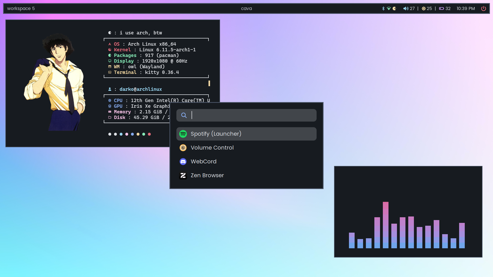

<div align="center">
<h1>owl</h1>
owl is a minimal tiling wayland compositor based on wlroots.
</div>

<br>

## features
- both tiling and floating toplevels
- keyboard focused workflow
- multimonitor and workspaces support
- easy configuration
- custom keybinds, monitor layouts etc
- ipc

> owl is made mainly for myself, implementing just enough for my workflow. that means a lot of things is just not there. if you are looking for something more mature take a look at hyprland, sway or river. 

## showcase
<div align="center">




</div>

## dependencies
- make
- wayland-protocols
- wayland-scanner
- wayland-server
- pixman
- libdrm
- libinput
- xkbcommmon
- wlroots >= 19.0 (git version on aur)

if you are using a wayland compositor you probably have those installed already.

> you can use an older wlroots version, 19.0 is just what i have used for development. to use an older version you only need to change line 5 in the makefile.

## building
```bash
git clone https://github.com/dqrk0jeste/owl
cd owl
make
```

## installation
it is recommended to install it by running
```bash
make install
```
it will also install the default config to `/usr/share/owl/default.conf`

> if you choose to uninstall it you can do so with `make unistall`.

## usage
```bash
owl
```

> it is recommended to run it from a tty.

## configuration
configuration is done in a configuration file found at `$XDG_CONFIG_HOME/owl/owl.conf` or `$HOME/.config/owl/owl.conf`. if no config is found a default config will be used (you need `owl` installed, see previous).

for detailed documentation see `examples/example.conf`. you can also find the default config in the repo.

## todo
- monitor hotplugging
- there are some known issues that need fixing, see `known-issues.md`
- more natural (output layout aware) output switching, rn it just focuses master even if the focus came from the right side for example
- mouse clicks for keybinds (for moving and resizing toplevels)
- opacity settings
- animations
