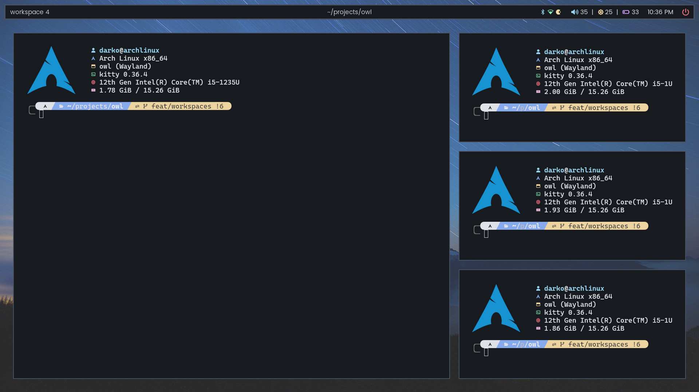
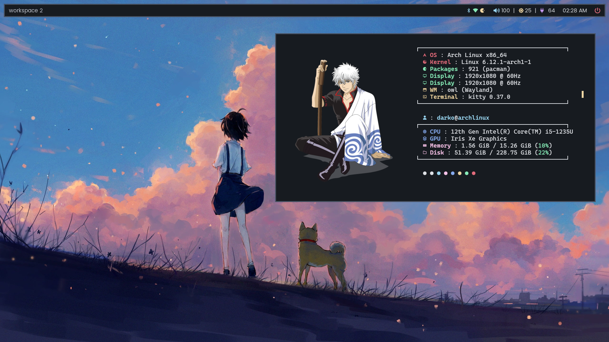

<div align="center">
<h1>owl</h1>

<br>
</div>

<br>

## features
- tiling and floating toplevels
- master layout with support for multiple masters, ideal for wide monitors
- keyboard focused workflow
- great multitasking with multimonitor support and workspaces out of the box
- smooth and customizable animations
- easy configuration with custom keybinds, monitor layouts etc
- ipc for integrating with other apps

> owl is made mainly for myself, implementing just enough for my workflow. that means a lot of things is just not there. if you are looking for something more mature take a look at hyprland, sway or river. 

## showcase
<div align="center">




</div>

## dependencies
- make
- wayland-protocols
- wayland-scanner
- wayland-server
- pixman
- libdrm
- libinput
- xkbcommmon
- wlroots >= 19.0 (git version on aur)

## building
```bash
git clone https://github.com/dqrk0jeste/owl
cd owl
make
```

## installation

### nixos
you can install `owl` by using [chaotic-cx/nyx](https://github.com/chaotic-cx/nyx) flake! 

for now `owl` exist only as `owl-wlr_git` package, just add it into your nixos / home-manager configuration and follow **usage** and **configuration** parts of `README.md`!

### other linux distributions
```bash
make install
```
it will also install the default config to `/usr/share/owl/default.conf`

> if you want to uninstall it you can do so with `make unistall`.

## usage
```bash
owl
```

> you probably want to run it from a tty

## configuration
configuration is done in a configuration file found at `$XDG_CONFIG_HOME/owl/owl.conf` or `$HOME/.config/owl/owl.conf`. if no config is found a default config will be used (you need `owl` installed, see above).

for detailed documentation see `examples/example.conf`. you can also find the default config in the repo.

## todos
- [ ] fix issues
- [x] animations
- [ ] rounded corners
- [ ] transparency
- [ ] blur
- [ ] drag and drop implementation
- [ ] monitor hotplugging
- [ ] complete foreign toplevel implementation
- [ ] add portals
- [ ] mouse clicks for keybinds (for moving and resizing toplevels)
- [ ] more ipc capabilities
